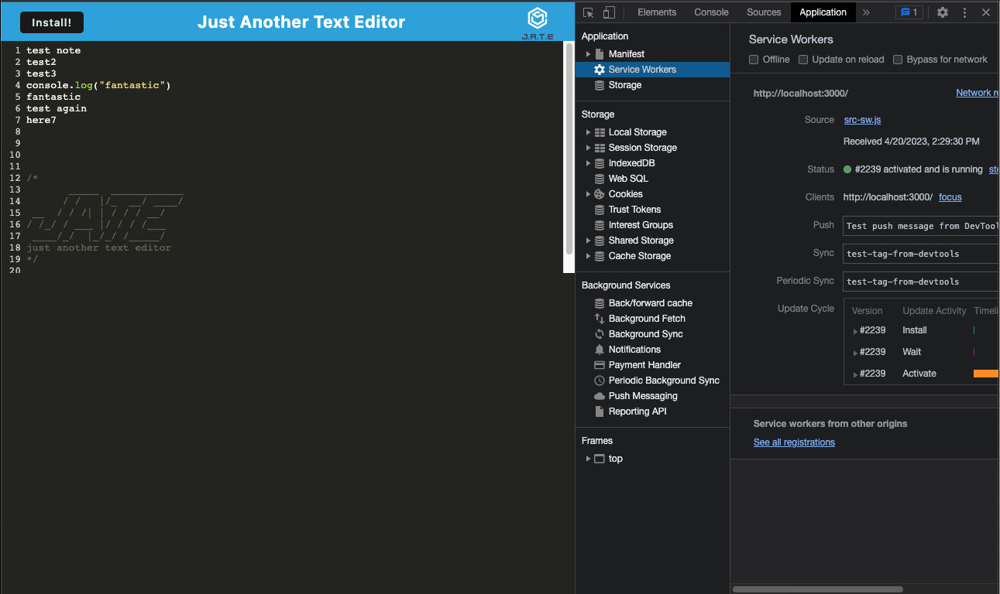
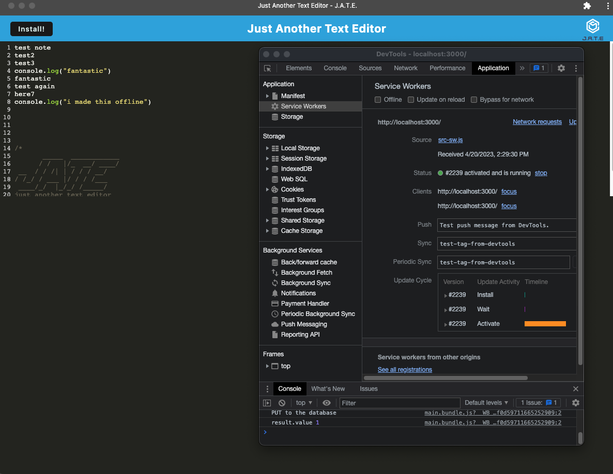
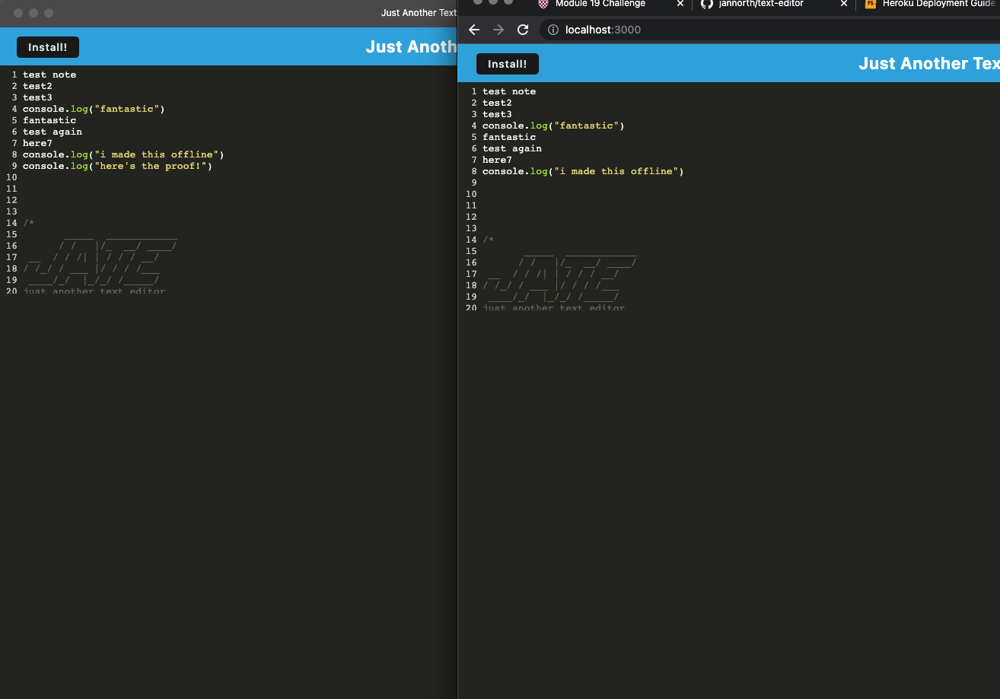
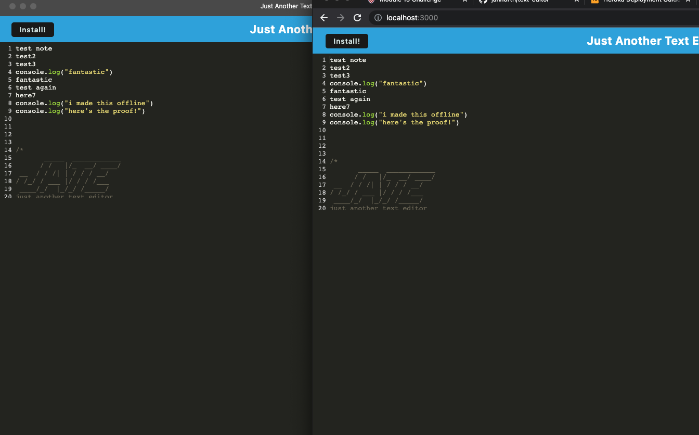

# text-editor

## Description

The purpose of this app is to make taking notes easy and accessible.

While using this app, it should solve the problem of being able to access notes while either working offline or online.

## Table of Contents

- [Installation](#installation)
- [Usage](#usage)
- [License](#license)

## Installation

Open the terminal from the root directory.

In the terminal, run the command, "npm install."

In the terminal, run the command, "npm run build."

In the terminal, run the command, "npm run start."

## Usage

Go to local host 3000

Download the text editor by clicking the "Install," button.

See how the text still saves, even while working offline.

Use the text editor to keep track of your work!

## License

This project is licensed under the terms of the MIT license. See the [LICENSE](LICENSE) file for details.